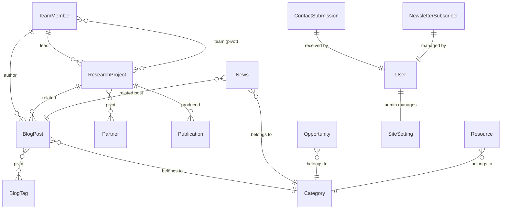

# 🔬 Analyse Complète & Guidelines — CARICS-Togo

## 1. Identité du Projet

**CARICS-Togo** (Centre Africain d'Action pour la Recherche et l'Innovation Communautaire en Santé) est un site web institutionnel pour un centre de recherche en santé publique basé au Togo.

| Aspect | Détails |
|---|---|
| **Stack** | Laravel 13 + Livewire 4 + Filament v5 + Tailwind v4 |
| **Auth** | Fortify (login, register, 2FA, passkeys, email verify) |
| **Admin** | Filament (panel "cpanel" → `/cpanell`) |
| **Frontend** | Template HTML "Archinest" (Bootstrap + jQuery + GSAP) + Livewire SFC |
| **DB** | SQLite (dev) |
| **Tests** | Pest 4 (Feature tests: Auth, Settings, Dashboard) |
| **Assets** | Vite 8 + Tailwind CSS v4 (Vite plugin) |
| **i18n** | FR/EN (middleware `SetLocale`, route `/lang/{locale}`) |

---

## 2. Architecture & Structure

### 2.1 Modèles (14 modèles)



| Modèle | Rôle | Scopes notables |
|---|---|---|
| [TeamMember](file:///c:/Users/D3vOs/Projets/Laravel/Web/carics-togo/app/Models/TeamMember.php) | Membres fondateurs/équipe | `published`, `founders`, `bureauExecutif`, `ordered` |
| [ResearchProject](file:///c:/Users/D3vOs/Projets/Laravel/Web/carics-togo/app/Models/ResearchProject.php) | Projets de recherche | `published`, `featured`, `ongoing`, `status` |
| [BlogPost](file:///c:/Users/D3vOs/Projets/Laravel/Web/carics-togo/app/Models/BlogPost.php) | Articles & fiches projet | `published`, `articles`, `projectSheets`, `recent` |
| [Category](file:///c:/Users/D3vOs/Projets/Laravel/Web/carics-togo/app/Models/Category.php) | Catégories polymorphiques | `forModel(class)`, `ordered` |
| [Publication](file:///c:/Users/D3vOs/Projets/Laravel/Web/carics-togo/app/Models/Publication.php) | Publications scientifiques | `published`, `ofType`, `recent` |
| [News](file:///c:/Users/D3vOs/Projets/Laravel/Web/carics-togo/app/Models/News.php) | Actualités | `published`, `featured`, `recent` |
| [Opportunity](file:///c:/Users/D3vOs/Projets/Laravel/Web/carics-togo/app/Models/Opportunity.php) | Offres & opportunités | `open`, `expiringSoon`, `ofContractType` |
| [Partner](file:///c:/Users/D3vOs/Projets/Laravel/Web/carics-togo/app/Models/Partner.php) | Partenaires | `active`, `ordered`, `ofType` |
| [Resource](file:///c:/Users/D3vOs/Projets/Laravel/Web/carics-togo/app/Models/Resource.php) | Ressources téléchargeables | `available`, `ordered` |
| [SiteSetting](file:///c:/Users/D3vOs/Projets/Laravel/Web/carics-togo/app/Models/SiteSetting.php) | Paramètres globaux (key/value) | `ofGroup` — helpers statiques `get()`/`set()` |
| [ContactSubmission](file:///c:/Users/D3vOs/Projets/Laravel/Web/carics-togo/app/Models/ContactSubmission.php) | Formulaire de contact | `unread`, `active`, `ofType` |
| [NewsletterSubscriber](file:///c:/Users/D3vOs/Projets/Laravel/Web/carics-togo/app/Models/NewsletterSubscriber.php) | Abonnés newsletter | `active`, `interestedIn` |
| [BlogTag](file:///c:/Users/D3vOs/Projets/Laravel/Web/carics-togo/app/Models/BlogTag.php) | Tags de blog | — |
| [User](file:///c:/Users/D3vOs/Projets/Laravel/Web/carics-togo/app/Models/User.php) | Utilisateurs admin | — |

### 2.2 Pages Frontend (Livewire SFC — Archinest theme)

| Route | Vue SFC | Page |
|---|---|---|
| `/` | `archinest::home` | Accueil |
| `/a-propos` | `archinest::about-us` | À propos |
| `/recherche-expertize-projet` | `archinest::research_expertize_project` | Recherche & Projets |
| `/ressource-publication` | `archinest::ressource-publication` | Ressources & Publications |
| `/actu-opportunites` | `archinest::actu-opportunites` | Actualités & Opportunités |
| `/equipe` | `archinest::team` | Équipe |
| `/equipe/{slug}` | `archinest::team-detail` | Détail membre |
| `/contact` | `archinest::contact` | Contact |

### 2.3 Admin Panel (Filament v5)

- **Panel** : `cpanel` accessible via `/cpanell`
- **Ressource Filament** : [TeamMemberResource](file:///c:/Users/D3vOs/Projets/Laravel/Web/carics-togo/app/Filament/Resources/TeamMembers/TeamMemberResource.php) — Structure exemplaire avec séparation Schemas/Tables/Pages
- **Couleur** : Amber | **Auth** : Login Filament

### 2.4 Données statiques

- [TeamData](file:///c:/Users/D3vOs/Projets/Laravel/Web/carics-togo/app/Data/TeamData.php) — Données hardcodées des 4 membres fondateurs (17 Ko)
- [config/site.php](file:///c:/Users/D3vOs/Projets/Laravel/Web/carics-togo/config/site.php) — Coordonnées de contact
- [config/site_media.php](file:///c:/Users/D3vOs/Projets/Laravel/Web/carics-togo/config/site_media.php) — Configuration médias

---

## 3. Constats & Problèmes Identifiés

### 🔴 Critiques

| # | Problème | Détails |
|---|---|---|
| 1 | **Duplication données / DB** | `TeamData.php` (264 lignes hardcodées) coexiste avec le modèle `TeamMember` + migration + Filament Resource. Les vues frontend utilisent probablement `TeamData`, pas Eloquent. |
| 2 | **Conflit template frontend** | Le layout `archinest.blade.php` charge **Bootstrap + jQuery + GSAP** via `<script>` classiques ET Tailwind/Livewire via Vite. Deux systèmes CSS concurrents. |
| 3 | **Pas de factories métier** | Seul `UserFactory` existe. Aucune factory pour les 13 autres modèles → tests difficiles. |
| 4 | **Seeder minimal** | Le `DatabaseSeeder` ne crée qu'un user de test. Aucun seeding des données métier. |
| 5 | **Publication.authors() — incompatible SQLite** | `FIELD()` est une fonction MySQL, le projet utilise SQLite → erreur certaine. |
| 6 | **URL admin** | Le path est `/cpanell` (double 'l') — probablement une typo. |

### 🟡 Améliorations

| # | Problème | Détails |
|---|---|---|
| 7 | **Pas de Filament Resources** pour la plupart des modèles | Seul `TeamMember` a un CRUD Filament. Il manque : BlogPost, ResearchProject, Publication, News, Opportunity, Partner, Resource, Category, ContactSubmission, NewsletterSubscriber, SiteSetting. |
| 8 | **Commandes artisan de génération** | [GenerateCARICSMigrations.php](file:///c:/Users/D3vOs/Projets/Laravel/Web/carics-togo/app/Console/Commands/GenerateCARICSMigrations.php) et [GenerateCARICSModels.php](file:///c:/Users/D3vOs/Projets/Laravel/Web/carics-togo/app/Console/Commands/GenerateCARICSModels.php) sont de gros fichiers monolithiques (33 Ko + 39 Ko) qui devraient être supprimés après usage. |
| 9 | **Correction.md non traitée** | Le fichier [correction.md](file:///c:/Users/D3vOs/Projets/Laravel/Web/carics-togo/correction.md) liste des bugs de contenu (fautes, texte template non nettoyé, boutons en anglais) qui semblent toujours en attente. |
| 10 | **Pas de tests métier** | Les tests couvrent Auth + Settings (issus du starter kit). Aucun test pour les modèles ou pages publiques. |
| 11 | **Media Library inutilisée** | `filament/spatie-laravel-media-library-plugin` est installé, mais aucun modèle n'utilise `HasMedia` / `InteractsWithMedia`. Les images sont stockées en `string` (champ `photo`, `cover_image`, `logo`). |
| 12 | **Route morte** | `Route::livewire('/1', 'pages::home')` — route `home2` qui semble être un résidu de développement. |

### 🟢 Points positifs

- ✅ Modèles bien structurés avec PHPDoc, scopes, casts, hooks `booted()`
- ✅ Structure Filament v5 exemplaire (séparation Schemas/Tables/Pages)
- ✅ SiteSetting avec cache invalidation automatique
- ✅ Catégories polymorphiques via `categorizable_type` — design flexible
- ✅ Auth complète (login, register, 2FA, passkeys, email verify)
- ✅ Configuration Pint, Larastan, Pest en place

---

## 4. Guidelines de Développement

### 4.1 Conventions de Code

```
✅ FAIRE                                    ❌ NE PAS FAIRE
─────────────────────────────────────────   ─────────────────────────────────────
Utiliser les scopes Eloquent               Écrire des where() bruts en répétition
Slug auto-généré dans booted()             Slug géré manuellement dans controller
JSON casts pour tableaux                   serialize()/unserialize()
Sections ─── commentées ─── dans models    Commentaires éparpillés sans structure
PHPDoc avec @return types                  Pas de type hints
Séparer Filament en Schemas/Tables/Pages   Tout dans le Resource principal
Utiliser SiteSetting::get('key')           Hardcoder les configs dans les vues
```

### 4.2 Naming Conventions

| Élément | Convention | Exemple |
|---|---|---|
| **Modèle** | Singulier, PascalCase | `TeamMember`, `BlogPost` |
| **Migration** | Préfixe `carics_` pour les tables métier | `carics_create_team_members_table` |
| **Scope** | Verbe/adjectif descriptif | `scopePublished`, `scopeOrdered`, `scopeForModel` |
| **Route name** | kebab-case | `team-detail`, `ressource-publication` |
| **Vue SFC** | `⚡` préfixe (convention Livewire) | `⚡home.blade.php` |
| **Filament Resource** | Dossier pluriel > fichier singulier | `TeamMembers/TeamMemberResource.php` |

### 4.3 Modèles — Structure Standard

Chaque modèle doit suivre cette structure :

```php
class ExampleModel extends Model
{
    use HasFactory;

    // ─── Attributs ──────────────────────────────────────────────────────
    protected $fillable = [...];
    
    protected function casts(): array { ... }

    // ─── Hooks ──────────────────────────────────────────────────────────
    protected static function booted(): void { ... }

    // ─── Relations ──────────────────────────────────────────────────────
    // PHPDoc en français pour chaque relation

    // ─── Scopes ─────────────────────────────────────────────────────────
    // Scopes réutilisables (published, ordered, featured...)

    // ─── Accesseurs ─────────────────────────────────────────────────────
    // Attributs calculés
}
```

### 4.4 Filament — Structure Standard (v5)

```
app/Filament/Resources/
└── {PluralModel}/
    ├── {Model}Resource.php          ← Routing + metadata
    ├── Pages/
    │   ├── List{Models}.php
    │   ├── Create{Model}.php
    │   ├── Edit{Model}.php
    │   └── View{Model}.php
    ├── Schemas/
    │   ├── {Model}Form.php          ← Schema du formulaire
    │   └── {Model}Infolist.php      ← Schema de la vue détail
    └── Tables/
        └── {Models}Table.php        ← Configuration du tableau
```

### 4.5 Frontend — Conventions Blade/Livewire

| Règle | Détails |
|---|---|
| **Layout** | Toutes les pages publiques utilisent `archinest` layout |
| **Components** | Préfixe `<x-archinest.*>` pour les composants du thème |
| **Langue** | Tout le texte visible doit être en **français** (sauf switch EN) |
| **SFC** | Les pages Livewire sont des Single File Components (`⚡`) |
| **Assets statiques** | Dans `public/archinest/` — ne pas mélanger avec les assets Vite |

### 4.6 Base de Données

| Règle | Détails |
|---|---|
| **Prefix migrations** | `carics_` pour les tables métier |
| **Soft deletes** | Non utilisés actuellement — ne pas ajouter sans raison |
| **JSON columns** | Préférer les casts `array` pour listes structurées |
| **Status strings** | Valeurs françaises (`publie`, `brouillon`, `en_cours`, `ouverte`) |
| **SQLite compat** | Éviter les fonctions MySQL-only (`FIELD()`, `JSON_EXTRACT` natif) |

### 4.7 Tests

| Règle | Détails |
|---|---|
| **Framework** | Pest 4 exclusivement |
| **Feature tests** | `RefreshDatabase` automatique dans `tests/Feature/` |
| **Organisation** | Dossiers par domaine : `Auth/`, `Settings/`, et à créer : `Public/`, `Models/`, `Filament/` |

---

## 5. Roadmap Recommandée (Priorités)

### Phase 1 — Stabilisation 🔴

- [ ] Supprimer `TeamData.php` → migrer toutes les vues vers le modèle `TeamMember` Eloquent
- [ ] Créer les factories manquantes (TeamMember, ResearchProject, BlogPost, etc.)
- [ ] Corriger `Publication::authors()` — remplacer `FIELD()` par `orderByRaw` compatible SQLite
- [ ] Corriger le path admin `/cpanell` → `/cpanel`
- [ ] Supprimer la route morte `/1` (`home2`)
- [ ] Appliquer les corrections de [correction.md](file:///c:/Users/D3vOs/Projets/Laravel/Web/carics-togo/correction.md)

### Phase 2 — Admin complet 🟡

- [ ] Créer les Filament Resources manquantes (BlogPost, ResearchProject, Publication, News, Opportunity, Partner, Resource, Category, ContactSubmission, NewsletterSubscriber, SiteSetting)
- [ ] Intégrer Spatie Media Library sur les modèles avec images (TeamMember, BlogPost, Partner, News)
- [ ] Créer un seeder complet avec données réalistes

### Phase 3 — Qualité 🟢

- [ ] Écrire des tests pour les pages publiques (smoke tests)
- [ ] Écrire des tests Filament (CRUD)
- [ ] Ajouter des tests de modèle (relations, scopes)
- [ ] Supprimer les commandes de génération (`GenerateCARICSMigrations`, `GenerateCARICSModels`)
- [ ] Résoudre le conflit Bootstrap/Tailwind (migration progressive vers Tailwind-only)

### Phase 4 — Fonctionnalités 🔵

- [ ] Formulaire de contact fonctionnel (Livewire + mail notification)
- [ ] Newsletter (double opt-in, mail envoi)
- [ ] Blog dynamique (list + detail pages branchées sur Eloquent)
- [ ] SEO (meta tags dynamiques par page, sitemap.xml, Open Graph)
- [ ] Internationalisation complète (fichiers `lang/`)

---

## 6. Commandes Utiles

```bash
# Développement
composer run dev                    # Serveur + queue + Vite

# Qualité
vendor/bin/pint --dirty --format agent   # Format PHP modifiés
php artisan test --compact              # Lancer les tests
composer types:check                    # Larastan

# Database
php artisan migrate:fresh --seed        # Reset + seed
php artisan tinker                      # Console interactive
```
